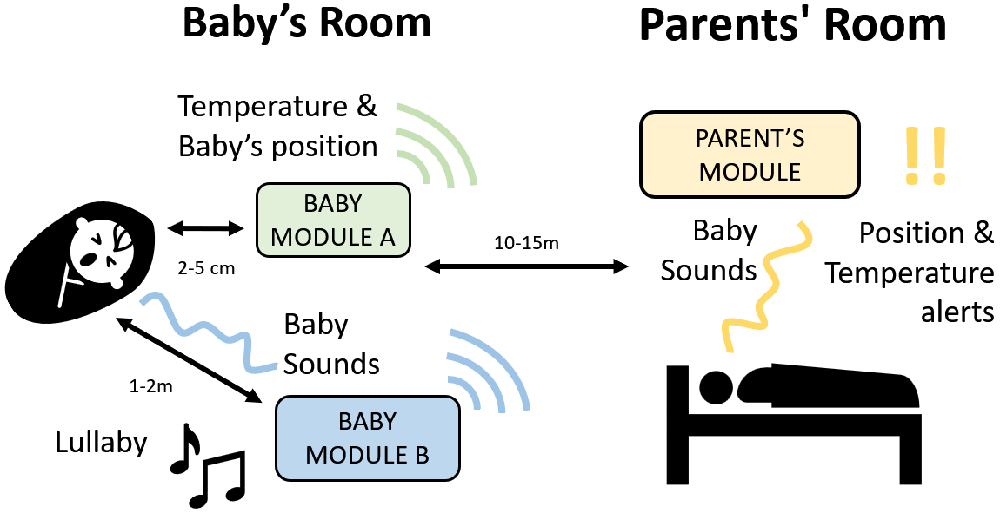
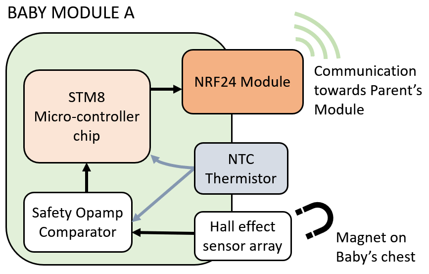
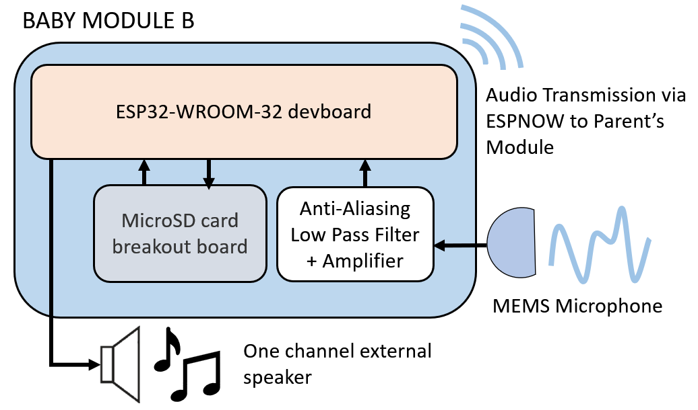
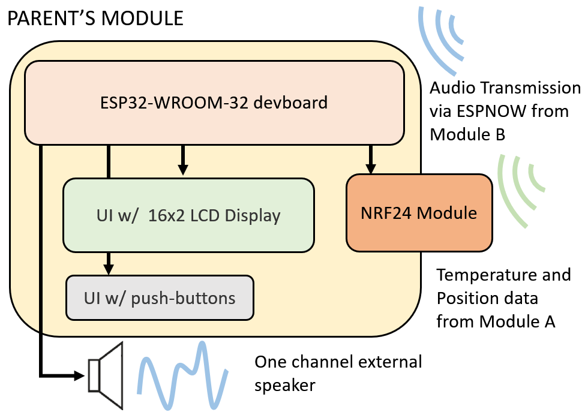

| Supported Targets | ESP32 | ESP32-C3 | ESP32-S2 | ESP32-S3 |
| ----------------- | ----- | -------- | -------- | -------- |

# ESPNOW Baby Sleep Radio Monitor
Project done for the Engineering Experience class @ Group T - Faculty of Engineering Technology / academic year 2022-23

De Greef Senne, Hsiung Chieh Fei, Rekkas Penelope, Tavares Quintao Arthur, Van Ranst Dries

Bachelor in Electronics Engineering, Faculty of Engineering Technology, Campus GROUP T Leuven, Andreas Vesaliusstraat 13,
3000 Leuven, Belgium

Coach(es): Gil Vranken

Electronics Engineering, Faculty of Engineering Technology, Campus GROUP T Leuven, Andreas Vesaliusstraat 13, 3000
Leuven, Belgium

## Abstract

The Baby Radio Monitoring System (BRMS) is a device designed to address Sudden Infant Death Syndrome
(SIDS), the leading cause of death for one-month- to one-year-olds. The design integrates a room temperature
and sleeping position monitor since both factors are thought to increase the risk of SIDS, according
to the Centers for Disease Control and Prevention. The BRMS is furthermore capable of detecting whether
a baby is crying. All temperature, position, and audio data is captured at the baby’s side, processed by a
microcontroller, and then sent wirelessly to the parent’s side.

<p align="center">
  
  <br>
  <em>Figure 1: Top-level block diagram</em>
</p>

The temperature monitor was built using a thermistor as its core component. An STM8S105K4 microcontroller
closely measures the voltage across this temperature-dependent resistor. This way, the BRMS is
capable of tracking the temperature in the baby’s room with up to 0.5 ◦C precision.

The position monitor was built using a Hall sensor as its core component. In addition, a magnet is placed
onto the baby’s chest which interacts with the Hall sensor. The voltage across the sensor changes according
to the magnetic field strength applied to it. Again, the STM8 records this voltage and can hence determine
in which position the baby is sleeping.

For the cry detector, audio signals arriving from a microphone were processed with an ESP32-WROOM-
32 microcontroller using digital processing techniques. The cry detector achieved an 88.4% accuracy in
distinguishing infant cries, showing the effectiveness of the cry detection algorithm.
Whenever crying, flipping, or unsafe temperature is detected at the infant’s side of the monitor, the parent
is warned through an LCD display present at their side. Hence, the BRMS is an effective baby monitoring
system.

## Design and materials

On the one hand, Baby Module A is designed to support an STM8S105K4 microcontroller chip (STM8) from ST Microelectronics. On the other hand,
Baby Module B and the Parent’s Module are designed around an ESP32-WROOM-32 microcontroller
development board (ESP32) from Espressif Systems.

The decision to use two different microcontrollers in the system is due to their varying capabilities. An 8-bit microcontroller like the STM8 is limited in its ability to perform complex tasks like Digital Signal Processing (DSP) for cry detection and audio streaming
between the Parent’s Module and Baby Module B. In contrast, the ESP32 is equipped with a Wi-Fi module, a 12-bit built-in analog-to-digital converter
(ADC), and an 8-bit digital-to-analog converter (DAC), making it a cost-effective solution for DSP and audio streaming. However, for tasks that
allow high latency and require low power consumption, such as temperature and position detection, the STM8 is a more efficient choice.

### Baby Module A

<p align="center">
  
  <br>
  <em>Figure 2.1: Block diagram of Baby Module A</em>
</p>

Aside from the STM8, Module A was equipped with an NTCLE100E3222*B0 thermistor, an AH277A Hall Sensor, an LM311 comparator, and a Si24R1 RF module (which is a clone of the nRF24 module) for wireless communication. A 0.02m x 0.01m N42 neodymium magnet is used in combination with the Hall sensor. As seen in Figure 2.1, a Hall effect sensor is used to detect a change in the polarity of a magnetic field. In the BRMS, a two-dimensional array of Hall sensors is
integrated into a soft mattress that is placed under the baby. Additionally, a neodymium magnet is attached
to the infant’s pyjamas at chest level. This way, in case the baby flips onto its belly, the position and orientation
of the magnet change. This is detected by the Hall sensors.

### Baby Module B

<p align="center">
  
  <br>
  <em>Figure 2.2: Block diagram of Baby Module B</em>
</p>

To meet the assignment requirements, a real-time wireless transmission system with cry detection signals is necessary. In addition to an
ESP32, the proposed Module B, depicted in Figure 2.2, includes an S15OT421 MEMS microphone with a signal-to-noise ratio of 58 dB for input signal pre-conditioning. A 6th-order Butterworth antialiasing filter with monotonic and linear delay is used to condition the microphone signal. Moreover, a MicroSD card breakout board (9) is included for storing pre-recorded lullabies and evaluating the DSP performance. The system, in addition, includes a female AUX connector to attach a one-channel external loudspeaker to play lullabies

### Parent's Module

<p align="center">
  
  <br>
  <em>Figure 2.3: Block diagram for the Parent's Module</em>
</p>

As shown in Figure 2.3, the Parent's Module utilizes several off-the-shelf components connected to the ESP32 development board. These components include a 16x2 LCD display, four pushbuttons, a Si24R1 RF breakout board, and an AUX female connector. The RF module receives temperature and baby position data from Module A, which is then displayed on the LCD. The four push buttons provide navigation options for the user. Additionally, the AUX connector enables audio playback from Module B, allowing parents and caregivers to listen to the audio feed.

## Testing the ESP32 Part of the Project

### Hardware Required

- A development board with ESP32 SoC (e.g., ESP32-DevKitC, ESP-WROVER-KIT, etc.)
- A USB cable for power supply and programming
- A microphone (with an amplifier) and one or two speakers for testing.

The following is the hardware connection:

| Hardware             | Module                   | GPIO                |
|:--------------------:|:------------------------:|:-------------------:|
| Microphone           | ADC1_CH0                 | GPIO36              |
| Speaker(R)           | DAC1                     | GPIO25              |
| Speaker(L)           | DAC2                     | GPIO26              |

### Code Initialization
For the receiver:
In `config.h`, set the macro `RECV` to 1.

## Pending Actions
- Improve the synchronization between network packet collection and filling task and `dac_i2s_write` tasks.
- Integrate the FFT program.

### Configure the Project

```
. $HOME/esp/esp-idf/export.sh
idf.py set-target esp32
idf.py menuconfig
```

- Set WiFi mode (station or SoftAP) under Example Configuration Options.
- Set ESPNOW primary master key under Example Configuration Options.
  This parameter must be set to the same value for sending and receiving devices.
- Set ESPNOW local master key under Example Configuration Options.
  This parameter must be set to the same value for sending and receiving devices.
- Set Channel under Example Configuration Options.
  The sending device and the receiving device must be on the same channel.
- Set Send count and Send delay under Example Configuration Options.
- Set Send len under Example Configuration Options.
- Set Enable Long Range Options.
  When this parameter is enabled, the ESP32 device will send data at the PHY rate of 512Kbps or 256Kbps,
  allowing data transmission over a long range between two ESP32 devices.
- Set WIFI AMPDM TX and RX under Component Configuration to false.

### Build and Flash

Build the project and flash it to the board, then run the monitor tool to view the serial output:

```
idf.py -p PORT flash monitor
```

To exit the serial monitor, type `Ctrl-]`.

See the Getting Started Guide for the full steps to configure and use ESP-IDF to build projects.

## Example Output

Here is an example of ESPNOW receiving device console output:

```
initializing i2s spk
Received 3264 packets in 10 seconds
Received 3392 packets in 10 seconds
Received 3264 packets in 10 seconds
Received 3328 packets in 10 seconds
Received 3200 packets in 10 seconds
Received 3328 packets in 10 seconds
Received 3264 packets in 10 seconds
```

Here is the example of ESPNOW sending device console output:

```
Init transport!
initializing i2s mic
Bytes available in stream buffer: 16384 
peak 1 at frequency 430.000000 Hz with amplitude 2.408174 
peak 2 at frequency 1892.000000 Hz with amplitude 2.283813 
peak 1 at frequency 1505.000000 Hz with amplitude 2.708347 
peak 2 at frequency 301.000000 Hz with amplitude 2.529614 
peak 1 at frequency 645.000000 Hz with amplitude 3.665064 
peak 2 at frequency 387.000000 Hz with amplitude 2.986069 
cry detected at f0 387.000000 Hz with amplitude 3.617141 and f2 1376.000000 with amplitude 2.395091
cry detected at f0 387.000000 Hz with amplitude 2.040233 and f2 1376.000000 with amplitude 1.812771
cry detected at f0 387.000000 Hz with amplitude 2.650546 and f2 1376.000000 with amplitude 2.321801
cry detected at f0 387.000000 Hz with amplitude 3.742941 and f2 1376.000000 with amplitude 2.673561
cry detected at f0 387.000000 Hz with amplitude 3.999676 and f2 1376.000000 with amplitude 2.550040
cry detected at f0 387.000000 Hz with amplitude 2.740722 and f2 1376.000000 with amplitude 1.979644

```

## Troubleshooting

If ESPNOW data cannot be received from another device, maybe the two devices are not on the same channel or the primary key and local key are different.

In a real application, if the receiving device is in station mode only and it connects to an AP, modem sleep should be disabled. Otherwise, it may fail to receive ESPNOW data from other devices.


